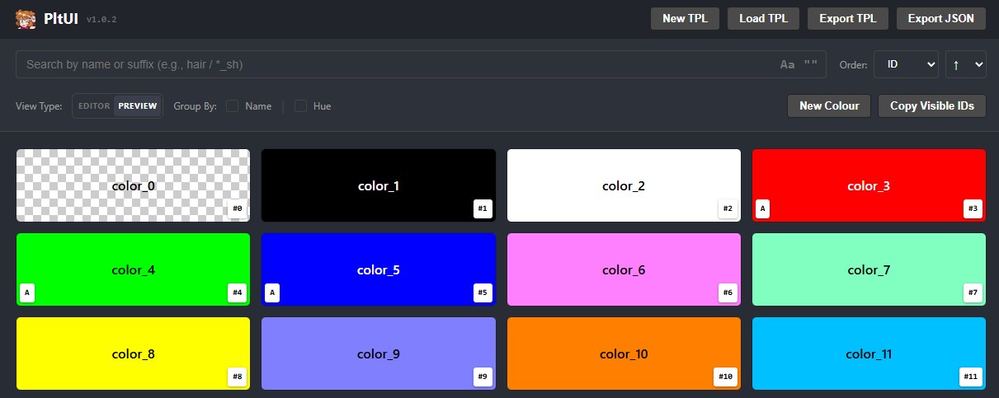
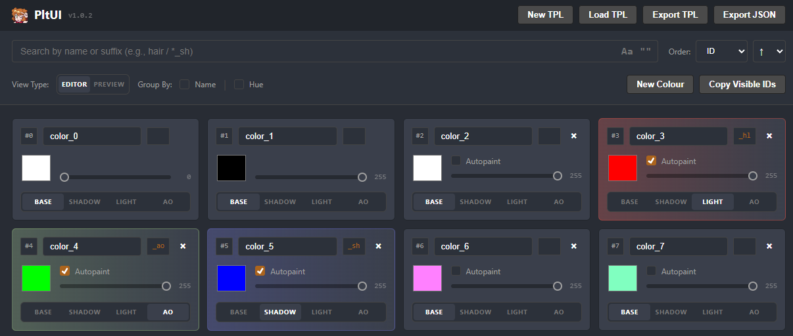

# PltUI
A cheerful, web-based UI for searching, managing, creating and editing OpenToonz / Tahoma2D palette files (`.tpl`).

---

## Features
- Load .tpl palette files (OpenToonz / Tahoma2D compatible)
- Powerful colour search engine across palettes including filter by hue / suffix (e.g., *_sh)
- Create, edit, and manage palettes
- Copy all filtered style IDs and paste to an FX
- Add, remove, and tweak colours
- Easily mark colours as shadow, highlight or ambient occlusion shadow
- Export palettes as JSON
- Runs entirely in the browser
- Single self-contained HTML file

## Supported Formats
- Input: `.tpl`
- Export: `.tpl`, `.json`

## License
Licensed under the Apache License 2.0. 
See the LICENSE.md file for details.
