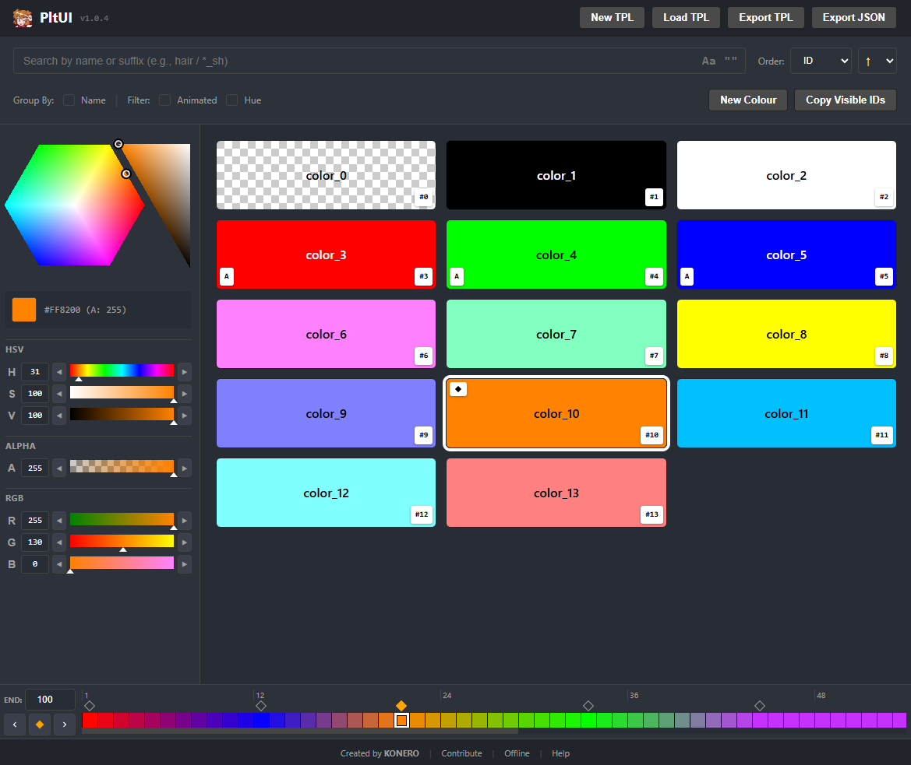

# PltUI

A cheerful, web-based palette manager for OpenToonz / Tahoma2D (`.tpl`) that runs entirely in the browser.
 

## Overview

PltUI helps you inspect, search, create, edit and export palette files used by OpenToonz and Tahoma2D. It focuses on fast workflows for artists and compositors: finding colors, marking roles (shadow/highlight/AO), copying style IDs for FX, and handling simple color animations.

## Features

- **Core**: Load and save `.tpl` palettes, create new palettes, add/remove colors, and export as `.tpl` or JSON.
- **Search**: A powerful search engine across palettes (supports wildcards, hue-based narrowing, and animation-aware queries) to quickly find relevant styles.
- **Editing & Roles**: Tweak color channels and alpha, mark colors as base/shadow/highlight/AO, rename, and toggle autopaint via a context menu.
- **Animation**: Inspect and edit per-color keyframes and preview interpolated colors on the timeline.
- **Integration & Workflow**: Copy filtered style IDs to the clipboard, and more.

## Quick Start

1. Open `index.html` in a modern browser.
2. Use the toolbar to create a new palette or load an existing `.tpl` file.
3. Search, filter, and sort colors using the controls in the filter bar.
4. Select a color to edit its channels, mark roles, or add keyframes in the timeline.
5. Export with the "Export TPL" or "Export JSON" buttons when finished.

## License

MIT

## Contributing

Bug reports, suggestions and pull requests are welcome. See the source in the repository for implementation details.

## Credits & Disclaimer

- Author: KONERO
- Not affiliated with OpenToonz or Tahoma2D.
- Repository: https://github.com/konero/PltUI
